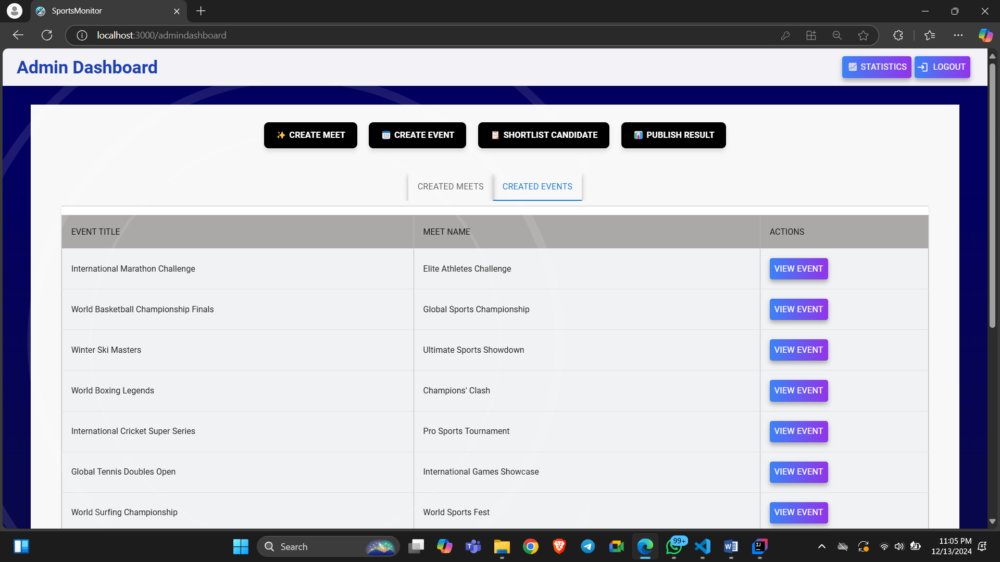
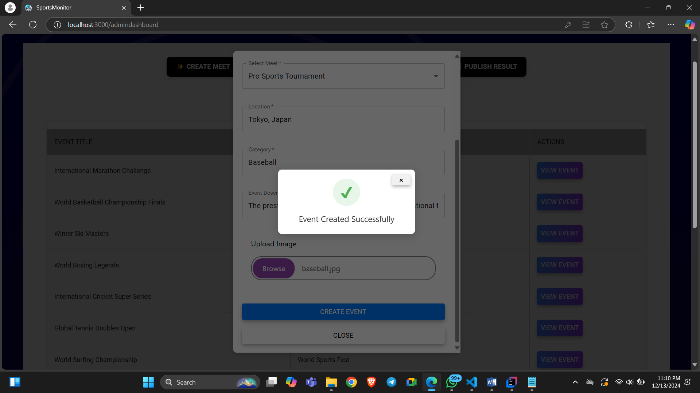
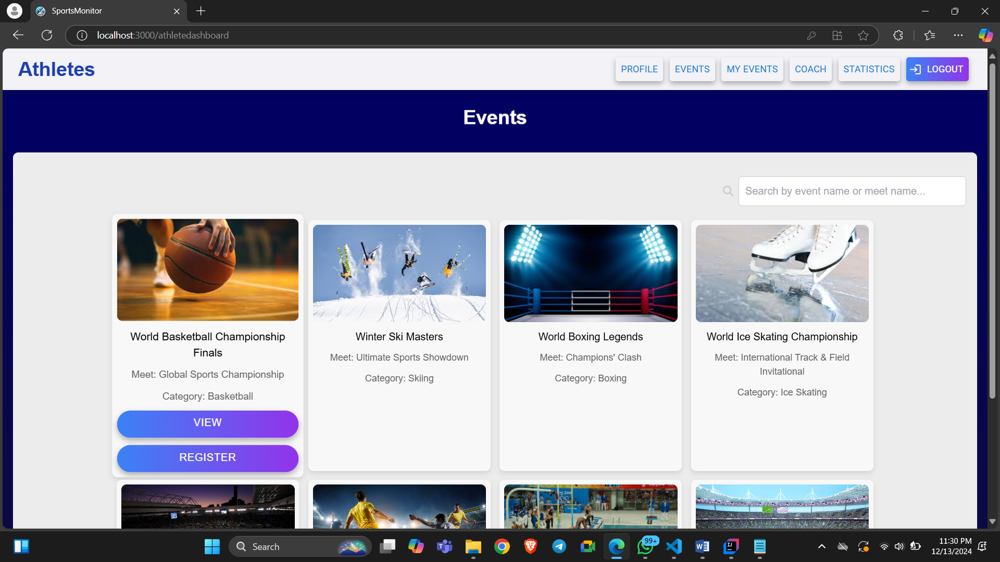

# Sports Monitor Project

## Introduction
Welcome to **Sports Monitor**, a comprehensive platform developed during the Infosys Springboard 5.0 Internship by a dedicated and talented team. This platform aims to bridge the gap between sports administrators, coaches, and athletes by providing a unified solution for event management, performance tracking, and personalized training support. By streamlining these processes, Sports Monitor helps enhance collaboration and improve athletic outcomes. Sports Monitor connects Admins, Coaches, and Athletes, offering seamless management of sports events and personalized tracking of athlete performance. This solution leverages cutting-edge technologies to optimize the sports event experience for all users involved.
---

## Table of Contents

1. [Features](#features)
2. [Screenshots](#screenshots)
3. [Technologies Used](#technologies-used)
4. [Database EER Diagram](#database-eer-diagram)
5. [Why Sports Monitor Stands Out](#why-sports-monitor-stands-out)
6. [Installation and Setup](#installation-and-setup)
7. [Developers](#developers)
8. [Contributing](#contributing)
9. [Acknowledgement](#acknowledgements)
10. [Future Enhancements](#future-enhancements)
11. [License](#license)

---

## Features

### Admin Role
- **Event & Meet Management**: Create, manage, edit, or delete sports meets and events.
- **Registration Review**: Approve or reject participant registrations based on event and participant details.
- **Result Publication**: Publish event results and track all events and outcomes through a centralized dashboard.

### Coach Role
- **Assistance Requests**: Efficiently handle assistance requests from athletes for optimal support.
- **Personalized Weight & Diet Plans**: Develop tailored weight and diet plans for athletes.
- **Performance Tracking**: Monitor athlete performance metrics and progress.

### Athlete Role
- **Profile Management**: Create and update personal profiles with up-to-date information.
- **Performance History**: Track performance history over time.
- **Event Registration & Status Tracking**: Browse and register for events, then monitor the registration status.
- **Results Access**: View results directly on the dashboard after event completion.
- **Assistance Requests**: Request personalized training guidance and weight plans.

---

## Screenshots

### Home
#### 1. Home Page


#### 2. Home : Features


#### 3. Home : Who it's for


#### 4. Home : Developer Team


#### 5. Registration Page


#### 6. Login Page


---

### Admin Dashboard
#### 1. Admin Dashboard: Meets


#### 2. Admin Dashboard : Events


#### 3. Admin Dashboard : Create Meet


#### 4. Admin Dashboard : Create Event-1


#### 5. Admin Dashboard : Create Event-2


#### 6. Admin Dashboard: Event Created


#### 7. Admin Dashboard : View Event-1


#### 8. Admin Dashboard : View Event-2


#### 9. Admin Dashboard : View Athlete Profile


#### 10. Admin Dashboard : Shortlist Candidate 


#### 11. Admin Dashboard : View Event


#### 12. Admin Dashboard : View Athlete


#### 13. Admin Dashboard : Publish Results


#### 14. Admin Dashboard : Publish Results-2


#### 15. Admin Dashboard : Statistics


---

### Athlete Dashboard
#### 1. Athlete Dashboard : Profile


#### 2. Athlete Dashboard : Past Records


#### 3. Athlete Dashboard : Edit Profile


#### 4. Athlete Dashboard : Successfully Edited


#### 5. Athlete Dashboard : All Events


#### 6. Athlete Dashboard : Register for Event


#### 7. Athlete Dashboard : View Event to Register


#### 8. Athlete Dashboard : Successfully Registered


#### 9. Athlete Dashboard : Registered Events 


#### 10. Athlete Dashboard : Completed Events - Pending Result


#### 11. Athlete Dashboard : Completed Events - Published Result


#### 12. Athlete Dashboard : View Result


#### 13. Athlete Dashboard : Coaches


#### 14. Athlete Dashboard : Coach Profile


#### 15. Athlete Dashboard : Assistance Requested


#### 16. Athlete Dashboard : Assistance Accepted


#### 17. Athlete Dashboard : Diet Plans


#### 18. Athlete Dashboard : Statistics


---

### Coach Dashboard
#### 1. Coach Dashboard : Profile


#### 2. Coach Dashboard : Edit Profile


#### 3. Coach Dashboard : Achievements


#### 4. Coach Dashboard : Add Achievement


#### 5. Coach Dashboard : Assistance Requests


#### 6. Coach Dashboard : View Athlete Profile


#### 7. Coach Dashboard : Accepted Athletes


#### 8. Coach Dashboard : Accepted Athlete section


#### 9. Coach Dashboard : Add weight plan


#### 10. Coach Dashboard : Diet Plans


#### 11. Coach Dashboard : Add Diet Plans


#### 12. Coach Dashboard : Statistics


---
## Technologies Used

### Frontend Technologies 🚀
- 
- 
- 
- 

#### Frontend Dependencies ⚙️
```json
{
  "@emotion/react": "11.10.5",
  "@fortawesome/react-fontawesome": "6.0.0",
  "axios": "0.24.0",
  "react-bootstrap": "2.0.0",
  "jwt-decode": "3.1.2",
  "react-icons": "4.3.1",
  "tailwindcss": "3.0.0",
  "react-router-dom": "5.1.0",
  "react-chartjs-2": "3.0.0"
}
```

---

### Backend Technologies 🔧
- 
- 
- 

#### Backend Architecture 📦
- **REST API**: We use RESTful services to ensure seamless communication between client and server.
- **DTO** (Data Transfer Object): For transferring data efficiently across layers.
- **Repository Layer**: Handles direct interaction with the database using Spring Data JPA.
- **Services Layer**: Business logic is implemented here to manage data flow between controllers and repositories.
- **Controller Layer**: Receives HTTP requests and returns responses, using RESTful principles.

---

### Database 🗄️
- 
Almost all the tables are normalized in BCNF or higher.
### API Testing 🧪
- 

---

## Database EER Diagram


---

## Why Sports Monitor Stands Out

- **Dynamic Event Management**: Offers flexible event management, allowing admins to adapt to real-time changes.
- **Enhanced Collaboration**: Fosters meaningful interactions between coaches and athletes for personalized guidance.
- **Empowering Athletes**: Advanced tools, including performance analytics dashboards and goal-setting modules, empower athletes to track their progress with real-time metrics, set achievable milestones, and receive personalized feedback from their coaches.

---

## Installation and Setup

### Prerequisites

- Java 17+
- Node.js and npm
- MySQL Server
- Maven

### Steps

1. **Clone the Repository**:

   ```bash
   git clone https://github.com/itsVaibhavSharma/sports-performance-monitoring.git
   cd sports-performance-monitoring
   ```

2. **Backend Setup**:

   - Navigate to the `backend` directory:
     ```bash
     cd backend
     ```
   - Update `application.properties` with your MySQL credentials.
   - Run the application using Maven:
     ```bash
     mvn spring-boot:run
     ```

3. **Frontend Setup**:

   - Navigate to the `frontend` directory:
     ```bash
     cd frontend
     ```
   - Install dependencies:
     ```bash
     npm install
     ```
   - Start the development server:
     ```bash
     npm start
     ```

4. **Access the Application**:
   - `http://localhost:3000`

   For admin, use:
   ```json
   username: 'admin'
   email: 'admin@admin.com'
   password: 'admin123'
   ```

---

## Developers
Meet the brilliant minds behind Sports Monitor, each bringing unique expertise to this innovative project. Vaibhav Sharma and Sania Begum collaborated as Full Stack Developers, contributing to both frontend and backend functionalities. Catherine Davidson specialized in frontend design, ensuring an intuitive and visually appealing user interface.

## Team Profiles  

<table align="center">
  <tr>
    <td align="center">
      <br>
      <strong>Vaibhav Sharma</strong><br>
      Full Stack Developer<br>
      <a href="https://www.linkedin.com/in/itsvaibhavsharma/" target="_blank"></a>
      <a href="https://github.com/itsVaibhavSharma" target="_blank"></a>
    </td>
    <td align="center">
      <br>
      <strong>Sania Begum</strong><br>
      Full Stack Developer<br>
      <a href="https://www.linkedin.com/in/sania-begum-shaik-735948256/" target="_blank"></a>
      <a href="https://github.com/ShaikSaniaBegum" target="_blank"></a>
    </td>
    <td align="center">
      <br>
      <strong>Catherine Davidson</strong><br>
      Frontend Developer<br>
      <a href="https://www.linkedin.com/in/catherine-davidson-a-63b4a6290/" target="_blank"></a>
      <a href="https://github.com/CatherineDavidson" target="_blank"></a>
    </td>
  </tr>
</table>

---
## Contributing
We welcome contributions to enhance Sports Monitor. Please follow these steps:
1. Fork the repository.
2. Create a feature branch:
   ```bash
   git checkout -b feature-name
   ```
3. Commit your changes:
   ```bash
   git commit -m "Description of changes"
   ```
4. Push to the branch:
   ```bash
   git push origin feature-name
   ```
5. Create a pull request.

---

## Acknowledgements
We thank Infosys Springboard 5.0 for providing this amazing internship opportunity and fostering innovation through collaboration. The supportive environment, access to mentorship, and resources significantly contributed to the development of Sports Monitor, enabling us to bring our ideas to fruition while learning valuable industry practices.

---

## Future Enhancements
- Integration with wearable devices for live performance tracking.
- AI-driven analytics for improved athlete performance insights.
- Enhanced UI/UX with additional accessibility features.

---

## License
This project is licensed under the MIT License.

---

We hope you enjoy using Sports Monitor as much as we enjoyed building it! Feel free to share your feedback and suggestions at [itsVaibhavSharma007@gmail.com](mailto:itsVaibhavSharma007@gmail.com)

